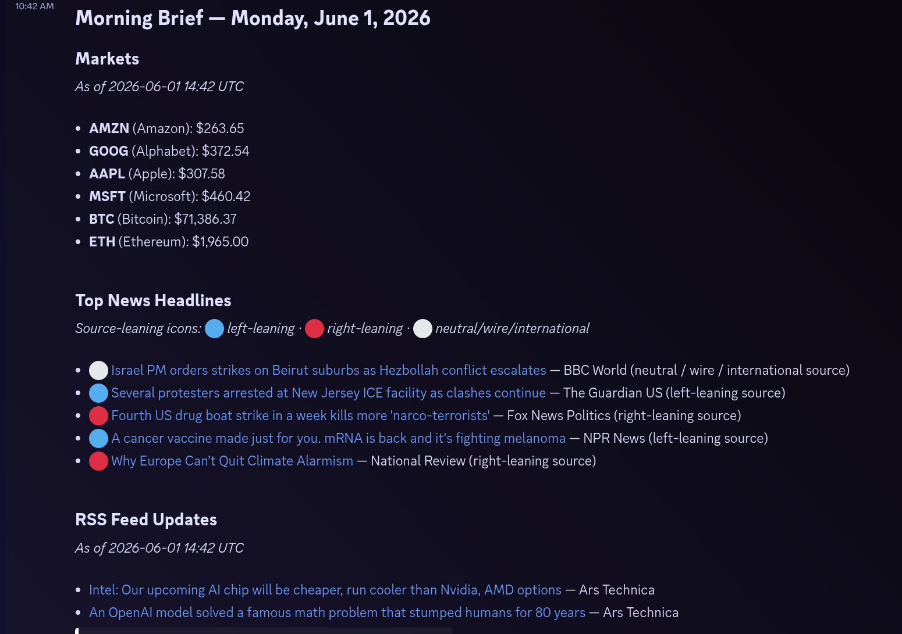

# Morning Brief



Morning Brief is a modular daily briefing tool. It currently builds a market update for AMZN, GOOG, AAPL, MSFT, Bitcoin, and Ethereum, includes top news headlines, today's new Daily Firehose RSS articles, and Todoist tasks due within the next week or overdue, then can post it to Discord.

## Setup

```bash
uv sync
cp .env.example .env
```

Edit `.env` and set `DISCORD_BOT_TOKEN` to the bot token formerly used for the OpenClaw-style Discord bot setup.

The default Discord channel is `#morning-brief`:

```text
1510832637407662142
```

Override it with `DISCORD_CHANNEL_ID` only if the channel changes.

For RSS articles, set `DAILY_FIREHOSE_API_TOKEN` to a Daily Firehose bearer token and set the same `AGENT_LINK_SECRET` in both Morning Brief and Daily Firehose. Morning Brief fetches articles from `DAILY_FIREHOSE_API_URL` and creates signed public `save-and-go` links using `DAILY_FIREHOSE_PUBLIC_URL`. Clicking an RSS article link saves it through Daily Firehose, then redirects to the article.

Top news headlines come from curated RSS sources with source-level leaning metadata. Icons are source labels, not per-article analysis:

- 🔵 left-leaning source
- 🔴 right-leaning source
- ⚪ neutral / wire / international source

Set `MORNING_BRIEF_NEWS_HEADLINE_LIMIT` to change the default top-news count from 5.

For Todoist tasks, set `TODOIST_API_TOKEN` (or `TODOIST_API_KEY`) to a Todoist API token. Morning Brief includes active tasks that are overdue or due within the next 7 days. Set `MORNING_BRIEF_TODOIST_TASK_LIMIT` to change the default task count from 20.

## Usage

Preview without posting:

```bash
uv run morning-brief preview
```

Post to Discord:

```bash
uv run morning-brief run
```

## Scheduling

Install and enable a systemd user timer for 6:00 AM Eastern:

```bash
uv run morning-brief install-schedule --time 06:00
```

Use another local time or timezone if needed:

```bash
uv run morning-brief install-schedule --time 07:30 --timezone America/New_York
```

Check the timer:

```bash
systemctl --user status morning-brief.timer
```

Inspect run logs:

```bash
journalctl --user -u morning-brief.service
```

Remove the schedule:

```bash
uv run morning-brief uninstall-schedule
```

## Extending

Add new briefing sources by implementing `BriefingModule` from `morning_brief.modules.base` and returning a `BriefSection`. Enable modules in `morning_brief.briefing.default_modules()`.

Delivery backends live under `morning_brief.delivery`.

## Notes

- Secrets belong in `.env`; do not commit them.
- Market data comes from Yahoo Finance's chart API via `requests`.
- Top news headlines come from curated RSS feeds across left-leaning, right-leaning, neutral, wire, and international sources.
- RSS article data comes from the local Daily Firehose API.
- Todoist task data comes from Todoist's REST API.
- `docs/implementation-plan.md` contains the agreed initial implementation plan.
